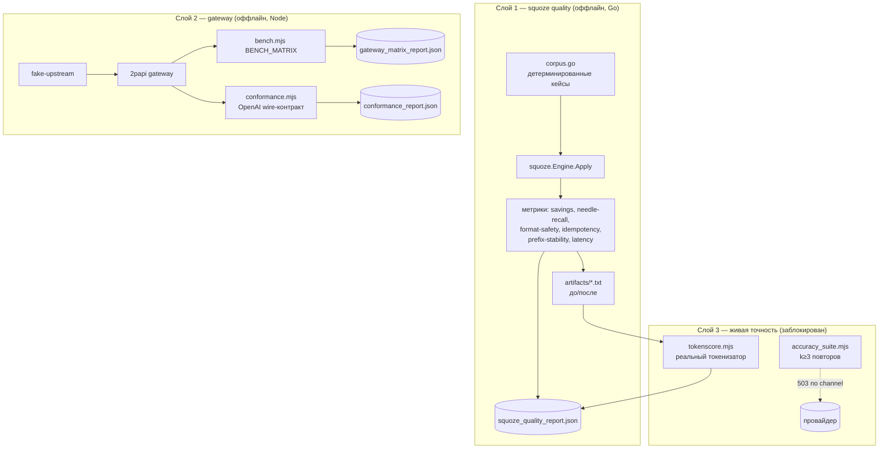

# Design — Benchmark Integrity Suite

Requirements: [requirements.md](requirements.md) · Tasks: [tasks.md](tasks.md)

## Overview

Три независимых слоя. Оффлайн-слои дают числа без провайдера и без ключей; живой слой готов, но заблокирован апстримом.

Почему так: единственный слой, который может доказать заявления **о самом squoze**, — оффлайн. Компрессор детерминирован (без нейросетей), поэтому его качество полностью измеримо без модели: сжатие либо сохранило факт, либо нет. Модель нужна только для того, чтобы измерить Δaccuracy — это Уровень 2 из `docs/eval-protocol.md`, и он блокируется провайдером, а не архитектурой.

## Компоненты

### 1. `test/squozebench/` (Go, `package main`)

| Файл | Ответственность |
|---|---|
| `corpus.go` | Кейсы: имя, класс, модель, тело запроса, `MustKeep[]`, ожидаемое поведение (`ExpectSqueeze`/`ExpectUntouched`), контракт формата |
| `metrics.go` | needle-recall, format-safety, idempotency, детерминизм, prefix-stability |
| `main.go` | прогон, latency (N повторов, p50/p95), запись JSON + артефактов |

Запуск в контейнере `golang:1.23` через `go run ./test/squozebench` (в модуле 2papi, так что берётся тот же `squoze v0.2.0`, который реально стоит в шлюзе — это важнее, чем тестировать апстримный репозиторий).

**Классы корпуса** (закрывают то, что тул обязан уметь, и то, чего он обязан не делать):

| Класс | Кейсы | Контракт |
|---|---|---|
| Должен сжимать | go-test 300 КБ с разбросанными FAIL, pytest c traceback, k8s-логи с ERROR, ANSI-прогрессбары, npm/pnpm install-шум | savings > 0, needle-recall 100% |
| Предел алгоритма | 200 FAIL-строк против `MaxKept=50` | recall < 100% ожидаемо, фиксируется как известный предел |
| Должен не трогать | Go-исходник со словами `assert`/`FAIL` в строках, проза про инцидент со словом «error», валидный JSON API-ответ, unified diff | выход байт-идентичен, либо формат остался валиден |
| Размерные гейты | тот же blob на 1 КБ / 3 КБ / 5 КБ против `MinBytes` claude=4096, gpt=2048, deepseek=1024 | сжатие включается ровно по порогу семейства |
| Кеш/мультиход | 3-ходовая сессия с повторным чтением файла | измеряется prefix_stable_bytes между ходами |

### 2. `test/conformance.mjs` (Node)

Проверки контракта wire-протокола против запущенного шлюза: SSE-кадры `data: ` + финальный `[DONE]`, `usage` в non-stream, форма `{error:{message,type}}`, 401 на неизвестный ключ, passthrough `tool_calls`, эхо-заголовки (`X-Gateway-Squoze`, `X-Gateway-Saved-Bytes`).

### 3. `test/tokenscore.mjs` (Node)

Читает артефакты до/после, считает токены через `gpt-tokenizer` (чистый JS, o200k/cl100k, без нативных сборок), доливает `tokens_*` обратно в `squoze_quality_report.json`. Для Claude помечается как прокси.

### 4. `test/accuracy_suite.mjs` (Node)

Живой раннер: preflight-проверка модели, `k` повторов на условие, агрегат median/IQR, отказ вместо публикации n=1.

## Data model — запись кейса в отчёте

| Поле | Тип | Значение |
|---|---|---|
| `name`, `class`, `model_family` | string | идентификация кейса |
| `bytes_before` / `bytes_after` / `savings_pct` | int/float | байтовая экономика |
| `blocks_squeezed`, `memo_hits`, `transforms[]` | из `squoze.Result` | что реально сработало |
| `needle_recall` | float 0..1 | доля выживших `MustKeep` |
| `needles_lost[]` | string[] | конкретные потерянные факты |
| `format_valid` | bool/null | JSON/diff-контракт (null = не применимо) |
| `idempotent`, `deterministic` | bool | контракты стабильности |
| `expectation_met` | bool | сработало ли ожидание класса |
| `latency_p50_ms`, `latency_p95_ms` | float | по N повторам |

## Error handling

- Паника внутри движка на кейсе → кейс помечается `engine_panic`, прогон продолжается (fail-open как у самого тула).
- Апстрим недоступен → живой слой пишет `status: "BLOCKED"` с кодом и текстом ошибки, exit code 0 (оффлайн-часть не должна краснеть из-за провайдера).
- Артефакты пишутся до подсчёта токенов, чтобы падение токенизатора не потеряло прогон.

## Тестовая стратегия

Харнесс сам является тестом; его собственная корректность проверяется тем, что negative-кейсы обязаны выдавать «не тронуто», а `MaxKept`-кейс — обязан выдавать recall < 100%. Если оба ожидания сойдутся, значит метрики считаются, а не выдумываются.

## Технические решения

| Решение | Альтернатива | Почему так |
|---|---|---|
| Тестируем squoze как зависимость 2papi | Клонировать репо squoze и гонять его тесты | Заявления README — про шлюз; важна та версия, что реально в бинаре |
| Оффлайн-корпус вместо датасетов LongBench/RULER | Скачать RULER/LoCoMo | Тул трогает только машинный вывод; needle-in-haystack на прозе он по контракту не сжимает — датасет мерил бы no-op. RULER остаётся правильным инструментом для Δaccuracy, когда появится провайдер |
| `gpt-tokenizer` (JS) | `tiktoken` через Python | Нет нативных зависимостей, Node уже в проекте |
| Docker `golang:1.23` | Установка Go на хост | На хосте нет Go; проект уже Docker-first |
