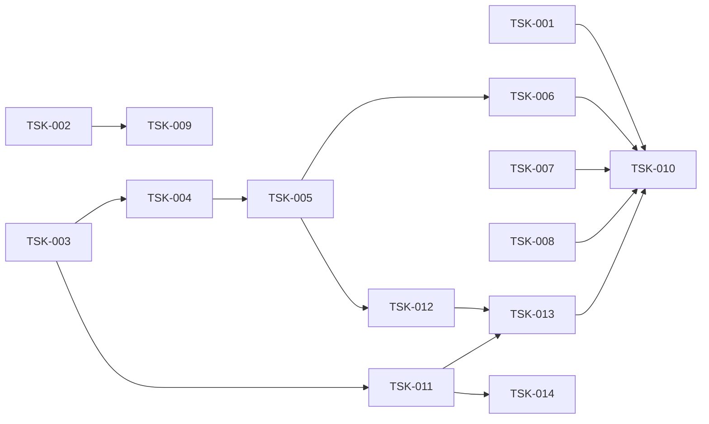

# Tasks — Benchmark Integrity Suite

Requirements: [requirements.md](requirements.md) · Design: [design.md](design.md)

## Фаза 1 — Аудит текущих заявлений

- [x] **TSK-001**: Зафиксировать расхождения README ↔ `test/results/*.json` ↔ `docs/benchmarks.md` с точными цифрами и первопричиной каждого.
  - Requirement: FR-9
  - Deliverables: раздел аудита в финальном отчёте
  - Acceptance: каждое заявление README сопоставлено с данными, которые его подтверждают или опровергают.

- [x] **TSK-002**: Проверить доступность апстрим-провайдера и задокументировать блокировку живого слоя.
  - Requirement: FR-10, AC-10.1
  - Deliverables: `test/provider_probe.mjs`, `test/results/provider_probe.json`
  - Acceptance: перечислены реально отдаваемые модели; если ни одна не работает — статус BLOCKED с кодами.

## Фаза 2 — Оффлайн-харнесс качества squoze

- [x] **TSK-003**: Собрать корпус кейсов по пяти классам из design.md.
  - Requirement: FR-1, AC-1.2
  - Deliverables: `test/squozebench/corpus.go`
  - Acceptance: ≥ 12 кейсов, включая negative и размерные гейты.

- [x] **TSK-004**: Реализовать метрики: needle-recall, format-safety, idempotency, детерминизм, prefix-stability, latency.
  - Requirement: FR-2, FR-3, FR-4, FR-5
  - Deliverables: `test/squozebench/metrics.go`
  - Acceptance: negative-кейсы дают «не тронуто»; `MaxKept`-кейс даёт recall < 100%.

- [x] **TSK-005**: Раннер: прогон, JSON-отчёт, артефакты до/после.
  - Requirement: FR-1, AC-1.1, AC-1.3
  - Deliverables: `test/squozebench/main.go`, `test/results/squoze_quality_report.json`
  - Acceptance: работает в `golang:1.23` без сети.

- [x] **TSK-006**: Токенный скоринг реальным токенизатором.
  - Requirement: FR-6
  - Deliverables: `test/tokenscore.mjs`, поля `tokens_*` в отчёте
  - Acceptance: экономия в токенах посчитана; для Claude помечена как прокси.

## Фаза 3 — Слой шлюза

- [x] **TSK-007**: Прогнать матрицу режимов против fake-upstream и сверить с `docs/benchmarks.md`.
  - Requirement: FR-7
  - Deliverables: `test/results/gateway_matrix_report.json`
  - Acceptance: расхождения > 20% помечены.

- [x] **TSK-008**: Конформность OpenAI-совместимости.
  - Requirement: FR-8
  - Deliverables: `test/conformance.mjs`, `test/results/conformance_report.json`
  - Acceptance: PASS/FAIL с фактическим наблюдением по каждой проверке.

## Фаза 4 — Живой слой (готов, заблокирован апстримом)

- [x] **TSK-009**: Раннер точности с k≥3 повторов, median/IQR, preflight.
  - Requirement: FR-10
  - Deliverables: `test/accuracy_suite.mjs`
  - Acceptance: отказывается публиковать n=1; при отсутствии модели — BLOCKED.

## Фаза 5 — Правка документации

- [x] **TSK-010**: Переписать бенч-раздел README по измеренным числам; удалить/переразметить бейджи; добавить «что не измерено».
  - Requirement: FR-9, AC-9.1, AC-9.2
  - Deliverables: `README.md`, `docs/benchmarks.md`
  - Acceptance: ни одного заявления без артефакта в `test/results/`.

## Фаза 6 — Ремонт корпуса и воспроизводимость A/B

- [x] **TSK-011**: Снять противоречие ожиданий на `json_api_list_800_rows` и перенести проверку конверта в грейдинг.
  - Requirement: FR-2, FR-3, AC-2.2, AC-3.1
  - Deliverables: `test/squozebench/corpus.go`, `test/squozebench/verify_test.go`
  - Acceptance: кейс объявляет ровно одно ожидание (`Class: structured-data`, `Expect: ExpectEither`), `format-invalid` в `cmp_savings.mjs` пуст, а потеря конверта ловится как `never-elide` — v0.2.0 падает на нём в каждом прогоне.

- [x] **TSK-012**: A/B-харнесс, не мутирующий `go.mod`.
  - Requirement: NFR-3
  - Deliverables: `test/squozebench/repro/{savings_ab.sh,accept.sh,cmp_savings.mjs,README.md}`, `.gitignore`
  - Acceptance: обе стороны собираются через `-modfile=go.local.mod`; прерванный прогон не оставляет `replace` в дереве; последняя строка вывода печатает пин `squoze v0.2.0` из нетронутого `go.mod`.

- [x] **TSK-013**: Пересобрать сохранённые отчёты текущими скриптами и согласовать снимок.
  - Requirement: NFR-3, FR-1
  - Deliverables: `test/results/squoze_ab/` (3 прогона на сторону + канонические `base`/`head`), `test/results/squoze_quality_report.json`
  - Acceptance: канонические файлы побайтово равны `base.1.json` / `head.1.json`; ни один сохранённый отчёт не описывает корпус, которого больше нет.

- [x] **TSK-014**: Закрыть три пина контрактов гейтом и вынести их в отдельное задание CI.
  - Requirement: NFR-3, FR-1
  - Deliverables: `test/squozebench/verify_test.go`, `.github/workflows/ci.yml`, `docs/benchmark-audit.md`, `test/squozebench/repro/README.md`, `README.md`, `CHANGELOG.md`
  - Acceptance: `go test -race ./...` зелёный на пине `squoze v0.2.0` (три `SKIP` вместо трёх `FAIL`), с `SQUOZE_CONTRACT_PINS=1` все три по-прежнему падают, задание `squoze-contract-pins` помечено `continue-on-error` и не входит в `needs` релиза.

## Dependency graph

## Progress

| Task | Статус | Артефакт |
|---|---|---|
| TSK-001 | Complete | `docs/benchmark-audit.md` |
| TSK-002 | Complete | `test/results/provider_probe.json` — все модели BLOCKED |
| TSK-003 | Complete | `test/squozebench/corpus.go` — 15 кейсов, 7 классов |
| TSK-004 | Complete | `test/squozebench/metrics.go` |
| TSK-005 | Complete | `test/results/squoze_quality_report.json` |
| TSK-006 | Complete | `test/tokenscore.mjs`, поля `tokens_*` |
| TSK-007 | Complete | `test/results/gateway_matrix_report.json` |
| TSK-008 | Complete | `test/results/conformance_report.json` — 9 pass / 0 fail / 3 inconclusive |
| TSK-009 | Complete | `test/accuracy_suite.mjs` — статус BLOCKED (апстрим) |
| TSK-010 | Complete | `README.md`, `docs/benchmarks.md` |
| TSK-011 | Complete | `corpus.go` + `verify_test.go` — конверт как needles, `format-invalid: none` |
| TSK-012 | Complete | `test/squozebench/repro/` — `-modfile=go.local.mod`, `go.mod` не мутируется |
| TSK-013 | Complete | `test/results/squoze_ab/` — 3+3 прогона, канонические пары сверены `cmp` |
| TSK-014 | Complete | `verify_test.go` гейт `SQUOZE_CONTRACT_PINS`, задание CI `squoze-contract-pins` |

## Результаты прогона

Корпус один и тот же — 15 кейсов, 7 классов (`should-squeeze`, `size-gate`,
`algorithm-limit`, `must-not-touch`, `structured-data`, `format-contract`,
`user-path`). Разница только в версии squoze, поэтому цифры двух сторон нельзя
смешивать: A/B прогоняется `test/squozebench/repro/savings_ab.sh`, 3 повтора на
сторону, отчёты в `test/results/squoze_ab/`.

### Сторона base — `squoze v0.2.0`, то, что пинит `go.mod` (2026-09-04)

11 pass · 3 fail · 1 known-limit · сжатие сработало на 11/15 · медиана
96.14% · p95 max 5.89 мс · `prefix_broken_models: [claude-opus-4-5, gpt-5]`.

Нарушения контрактов, подтверждённые отдельными тестами в `test/squozebench/verify_test.go`:

1. **`touched-protected-content`** — исходный код, плотный по маркерам `FAILED`/`PASSED`/`assert `, элидируется как машинный вывод (85–92% срезано, Go становится синтаксически битым). Калибровка: на реальных файлах репозитория срабатывает 1 из 93 (и это собственный `corpus.go`), на реальных `_test.go` — 0 из 64 (score 1 против порога 3). Опасность латентная, инцидентность близка к нулю.
2. **`never-elide`** — при подъёме списка в Markdown-таблицу теряются все три поля конверта: `has_more`, `next_cursor`, `total_count` (recall 0/3). Читатель распакованной таблицы делает вывод, что список кончился, и перестаёт листать.
3. **Недетерминизм** — `tryTabularLifting` строит порядок колонок обходом Go-map: 3 разных порядка на 12 свежих движках. Прямое нарушение cache-safe контракта.
4. **`PREFIX-BROKEN`** — кросс-turn дедуп переотправляет ранний ход в ПОЛНОМ виде (4 245 → 29 159 байт) из-за самопротиворечивого guard в `stream_scanner.go`.

### Сторона head — рабочее дерево squoze, тега нет (2026-09-05)

14 pass · 0 fail · 1 known-limit · сжатие сработало на 9/15 · медиана
97.02% · p95 max 5.62 мс · `contract_violations: {}` · `prefix_broken_models: []`.

Все четыре нарушения закрыты. Два кейса из знаменателя ушли намеренно
(`go_source_dense_in_test_words`, `realistic_test_helper_source` больше не
сжимаются — это выполненный must-not-touch), поэтому медиана по всем 15 кейсам
падает 87.44% → 76.20%, а сравнимая медиана по кейсам, которые сжимают обе
стороны, держится: 97.06% → 97.02%, −0.03 pp.

Known-limit один и тот же на обеих сторонах: `go_test_200_fails_vs_maxkept50`
при `MaxKept=50` оставляет 17 из 200 строк `FAIL`, потеря раскрыта в маркере.

**Ограничение поставки.** Тега выше `v0.2.0` у squoze нет, поэтому `go.mod`
пинит релиз, и потребитель шлюза получает поведение стороны base. Головные
цифры действительны только под `-modfile=go.local.mod` до момента тега.

### Слой шлюза

Матрица режимов: squoze на 633 КБ измерен 74.7 / 146.6 мс против
задокументированных 438.56 — цифра в `docs/benchmarks.md` устарела.

Байты против токенов: расхождение ≤ 0.6 pp на элидированном машинном выводе, но
76.2% байт против 63.7% токенов на подъёме в таблицу (−12.5 pp) — Markdown-пайпы
токенизируются хуже заменяемого JSON. `test/tokenscore.mjs` помечает любой кейс с
расхождением ≥ 5 pp.
