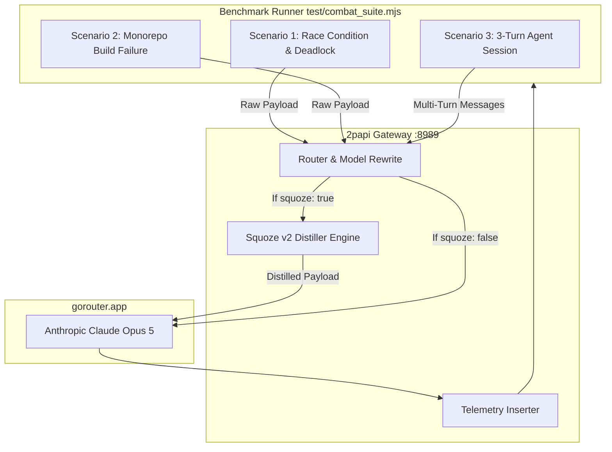

# Design — Squoze Combat Benchmark Suite

## 1. System Architecture

---

## 2. Test Scenarios & Ground Truth

### Scenario 1: Distributed Race Condition & Mutex Deadlock
- **Input Payload:**
  - `role: user` asks for root cause and fix.
  - `role: tool` (name: `git_diff`): Contains 120 lines of changes in `pkg/session/manager.go` (where a conditional early return does not call `mu.Unlock()`) plus 800 lines of `go.sum` noise.
  - `role: tool` (name: `terminal_logs`): 180 lines of simulated wrk/k6 load test output with ANSI progress bars, 200 OKs, and 3 lines showing:
    `[2026-09-03T01:14:02.819Z] ERROR session_manager.go:142 mutex acquisition timeout after 5000ms: worker-47 deadlock`
  - `role: tool` (name: `otel_trace`): JSON dump with 12 spans; span `sp-9` has status `DEADLINE_EXCEEDED` on lock acquisition.
- **Ground Truth Assertions:**
  1. Identifies missing `mu.Unlock()` or recommends `defer mu.Unlock()`.
  2. Pinpoints file `pkg/session/manager.go` around line 142.
  3. Emits correct Go patch without regressions.

### Scenario 2: Monorepo ESM/CJS Subpath Export Collision
- **Input Payload:**
  - `role: tool` (name: `build_logs`): 220 lines of `pnpm build` output, Next.js telemetry, webpack deprecation warnings, with a buried failure:
    `Error [ERR_PACKAGE_PATH_NOT_EXPORTED]: Package subpath './v2/client' is not defined by "exports" in packages/core/package.json`
  - `role: tool` (name: `lockfile_diff`): 1,500 lines of `pnpm-lock.yaml` diff.
- **Ground Truth Assertions:**
  1. Identifies missing `./v2/client` export in `packages/core/package.json`.
  2. Distinguishes ESM/CJS export fields (`import` vs `require`).
  3. Provides updated `package.json` exports block.

### Scenario 3: 3-Turn Agent Diagnostic Session
- **Turn 1**:
  - User asks to inspect test failures.
  - Assistant calls `run_test`.
  - Tool output: 140 lines of pytest output with 1 assertion error in `test_billing.py:88`.
- **Turn 2**:
  - Assistant calls `read_file` on `billing/calculator.py` (500 lines) and `read_file` on `config/rates.json` (large JSON array).
- **Turn 3**:
  - Assistant calls `run_test` again.
- **Evaluation:**
  - Squoze Dedup Engine prunes the duplicate read of `billing/calculator.py` across turns.
  - Token accumulation rate: Squoze should be $40-60\%$ lower on Turn 3.

---

## 3. Metrics Matrix

| Metric | Measurement Method | Target / Success Criteria |
|---|---|---|
| **Input Tokens (Raw vs Squoze)** | Upstream usage stats / prompt character count | $\ge 50\%$ token reduction |
| **Squoze Latency Overhead** | `X-Gateway-Squoze-Latency-Ms` | $\le 2.0$ ms (stream scanner) |
| **Gateway Proxy Overhead** | `X-Gateway-Overhead-MS` | $\le 5.0$ ms |
| **Root-Cause Accuracy** | Automated regex ground-truth verification | 100% ground truth match |
| **Monetary Cost per Call** | gorouter dashboard log balance delta | Direct proportional cost reduction |
