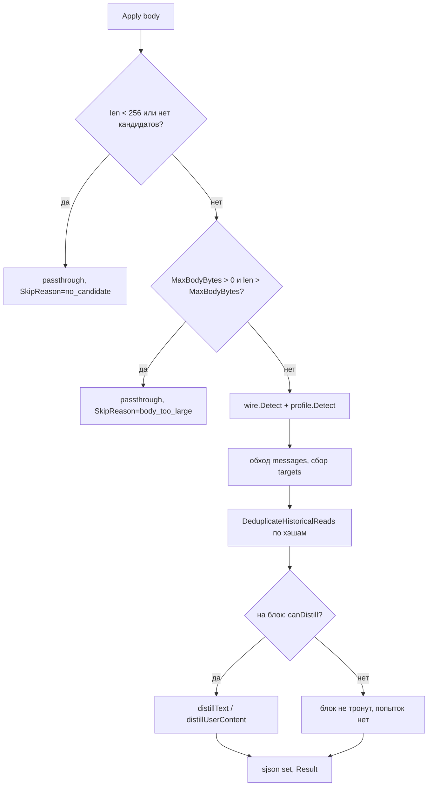

# Design — Squoze Work Guard & Envelope Reach

Requirements: [requirements.md](requirements.md) · Tasks: [tasks.md](tasks.md)

## Overview

Две правки в squoze, одна в 2papi, один релиз v0.4.0.

1. **Гейт работы** — публичный `Limits` + структурный предпроход на блок.
   Предпроход обязан быть **output-neutral**: он снимает только те попытки
   дистилляции, которые в v0.3.0 гарантированно возвращают пустую строку.
   Единственное ограничение, которому разрешено менять выход, — жёсткий кап
   `MaxBodyBytes`, и он выключен по умолчанию.
2. **Досягаемость лифтинга** — поиск массива по структуре вместо списка из
   четырёх имён.

Почему именно так: измеренная стоимость — не одна большая операция, а сумма
попыток по блокам, каждая из которых заканчивается отказом. Значит выигрыш даёт
не таймаут, а **отказ до попытки**, и такой отказ можно сделать побайтно
нейтральным — что и превращает гейт из обмена «латентность против экономии» в
чистое снятие лишней работы.

## Architecture



Новый узел здесь только `G`. Узлы `B`, `D`, `E`, `F`, `I` существуют.

## Публичный API squoze (аддитивно)

```go
// Limits bounds the work Apply may do. The zero value imposes no limits and
// reproduces v0.3.0 exactly. Every field is a byte count, never a duration:
// a wall-clock deadline would make output timing-dependent and break the
// cache-safety contract that identical bytes produce identical output.
type Limits struct {
    MaxBodyBytes  int // skip the whole request above this size; 0 = unlimited
    MaxBlockBytes int // skip one content block above this size; 0 = unlimited
    MinBlockBytes int // do not attempt below this size; 0 = built-in 64-byte floor
}

func NewEngineWithLimits(memoCapacity int, lim Limits) *Engine
func (e *Engine) Limits() Limits
```

`Result` расширяется двумя полями:

```go
Skipped    bool   // Apply returned the body untouched by an explicit decision
SkipReason string // body_too_large | no_candidate | too_small | ""
```

`NewEngine(cap)` остаётся и эквивалентен `NewEngineWithLimits(cap, Limits{})`.

## Компонент 1 — canDistill (предпроход)

`internal/engine/prescan.go`, чистая функция без состояния:

```go
// canDistill reports whether any pass in distillText could accept s. It must
// stay in lockstep with distillText: a false here has to mean the same as an
// empty string there, or the guard changes output instead of only removing work.
func canDistill(s string, lim Limits) (bool, string)
```

Порядок проверок — от самой дешёвой к самой дорогой, зеркально пассам `distillText`:

| Проверка | Пасс, который она разрешает | Стоимость |
|---|---|---|
| `len(s) < floor` | ничего | O(1) |
| `MaxBlockBytes` превышен | ничего | O(1) |
| префикс `diff --git` / наличие `@@ ` | пасс 1, `DistillDiff` | O(1)/O(n) один скан |
| trimmed начинается с `{` или `[` | пасс 2, `DistillJSON` | O(1) |
| есть ESC или CR | пасс 3, терминальная чистка | один скан |
| `router.Classify` вернул log/test | пасс 3, `compress.Text` | уже вызывается сейчас |
| иначе | ни один пасс не примет | — |

Ключевой инвариант: для `KindCode` и прозы без маркеров `distillText` в v0.3.0
уже возвращает пустую строку — предпроход лишь узнаёт это раньше, до
`json.Unmarshal` в `DistillJSON` (самая дорогая из отвергнутых попыток: 23.6 ms
на блобе 420 KB).

Дедуп остаётся **до** гейта: он экономит независимо от формы блока, и его хэши
считаются по уже собранным targets.

## Компонент 2 — структурный поиск массива

`internal/distill/json_tabular.go`, замена цикла по четырём именам:

```go
// findLiftableArray returns the gjson path to the array most worth lifting and
// the array itself. Search is bounded: root, then each object value one level
// down. Deterministic tie-break: shallowest depth first, then document order,
// then the longer array — so the same bytes always yield the same path.
func findLiftableArray(v any, raw string) (items []any, path string, parent map[string]any)
```

- глубина 0: сам корень — массив (`@this`, как сейчас);
- глубина 1: любое значение-массив в корневом объекте (`rows`, `matches`, ...);
- глубина 2: значение-массив в объекте, лежащем в корневом объекте
  (`result.matches` — форма MCP-ответов);
- глубже не идём: NFR-3 и предсказуемость.

`scalarSiblings(raw, arrayPath)` меняется с «ключ в корне» на «путь»: сиблинги
берутся из **родительского** объекта найденного массива, поэтому конверт
раскрывается и для `result.rows`. `orderedColumns` и `tableHeadline` уже
принимают `arrayPath` и работают с любым gjson-путём — правки не требуют.

Порог `tabularMinSavings = 0.35` и лимит 12 колонок остаются.

## Компонент 3 — проводка в 2papi

`internal/proxy/proxy.go:211` — движок создаётся один раз на процесс, поэтому
`Limits` нельзя зашить в конструктор при запросном скоупе. Решение: держать
пул движков по значению `Limits` (их немного — global/model/virtual), ключ —
сама структура (comparable):

```go
var squozeEngines sync.Map // Limits -> *squoze.Engine
func engineFor(lim squoze.Limits) *squoze.Engine
```

Разрешение значения на запрос: virtual > model > global, первое ненулевое; ноль
означает «не задано». Заголовок `X-Gateway-Squoze-Max-Body` в разрешении не
участвует и движков не создаёт — он может только **ужать** бонд для одного
запроса (см. «Отклонения», О5). Парсится строго; мусор игнорируется и
логируется, а не роняет запрос.

После `Apply`:

```go
if res.Skipped {
    w.Header().Set("X-Gateway-Squoze-Skip", res.SkipReason)
}
```

Существующие `X-Gateway-Squoze`, `-Format`, `-Latency-Ms`, `-Transforms`,
`-Memo-Hits` продолжают выставляться как сейчас.

Конфиг: `squoze_max_body_bytes int` в `config.Global`, `config.Model`,
`config.Virtual` (тип `int`, ноль = не задано, наследование как у остальных
squoze-полей).

## Error handling

| Ситуация | Поведение |
|---|---|
| `MaxBodyBytes` меньше `MinBlockBytes` | значения независимы, конфликт невозможен; оба применяются как заданы |
| мусор в `X-Gateway-Squoze-Max-Body` | заголовок игнорируется, WARN в лог, запрос идёт с конфигом |
| `canDistill` сказал «да», а пасс вернул пусто | штатно: блок остаётся исходным, как в v0.3.0 |
| массив найден, но лифтинг отклонён порогом | падаем на `pruneValue`, как сейчас |
| невалидный JSON | `DistillJSON` возвращает fail-open (существующее поведение) |

## Тестовая стратегия

1. **Output-neutrality (AC-2.1)** — таблично по всему корпусу
   `test/squozebench`: `Apply` без гейта против `Apply` с гейтом,
   `bytes.Equal`. Это главный тест спеки; он же защищает от «оптимизации»,
   которая тихо теряет экономию.
2. **Zero-value эквивалентность (AC-1.1)** — `NewEngine` против
   `NewEngineWithLimits(cap, Limits{})` на том же корпусе.
3. **Кап (AC-1.2)** — тело выше капа: выход идентичен входу, флаги выставлены,
   `json.Unmarshal` не вызывался (проверяется через отсутствие изменений и
   `BlocksSqueezed == 0`).
4. **Реестр обёрток (AC-3.1)** — параметризованный тест по именам
   `data|items|results|records|rows|matches|files|entries|hits|diagnostics|logs|choices|content|list`
   плюс `result.rows` (глубина 2): экономия одинаковая, лифтинг сработал.
5. **Регрессии контрактов** — `TestJSONEnvelopeLoss`,
   `TestJSONTabularDeterminism`, `TestDedupReExpandsHistory`,
   `TestIdempotencyAcrossCorpus` в `test/squozebench/verify_test.go` остаются
   зелёными без правок (они и есть контракт).
6. **Латентность (AC-2.2, NFR-3)** — бенчмарк на формах «различное содержимое»:
   `internal/engine/shape_bench_test.go`, промоушен разового пробника в
   постоянный бенч (генераторы: JSON-конверт, проза, код, логи; 60 и 300 турнов).
7. **Шлюз (AC-4.1, AC-4.2)** — тест на заголовки и наследование конфига в
   `internal/proxy`.

## Технические решения и альтернативы

**Дедлайн по wall-clock — отклонён.** Выглядит как прямое решение «гарда
латентности», но делает выход зависимым от времени: на загруженном хосте один и
тот же запрос дал бы то сжатый, то несжатый префикс. Это ломает и контракт
детерминизма squoze, и prompt-cache провайдера, а сломанный кэш стоит дороже,
чем сэкономленные миллисекунды. Отклонено по NFR-1.

**Расширить список имён обёрток — отклонён как решение.** Быстро, но переносит
дефект в будущее: следующий тул назовёт массив `edges`, `nodes`,
`observations`, `spans`. Список имён — не контракт данных; структура — контракт.
Поиск по структуре с ограниченной глубиной покрывает и уже известные имена, и
неизвестные, за ту же цену (обход корневого объекта, который gjson и так делает).

**Гейт на стороне 2papi (без правок squoze) — отклонён пользователем.**
Согласовано: правильное место для решения «стоит ли разбирать это тело» —
библиотека, которая знает свои пассы; иначе каждый потребитель squoze
переизобретает эвристику по подстрокам.

**Порог 35% не понижаем.** Соблазн — «поднять экономию» на строках с длинными
различающимися значениями. Но там таблица действительно почти не меньше
исходника, а lossy-обрезка ячеек уже учтена в `sanitizeCell` и раскрывается в
заголовке. Понижение порога дало бы косметическую экономию за счёт читаемости.

## Отклонения при реализации

Нумерация О-x — отклонения от плана; Д-x в requirements.md — дефекты, которые
спека закрывает. Каждое отклонение здесь сознательное и стоит с причиной.

**О1 — гейт стоит в `distillText`, а не в двух сканерах (TSK-303).** План
предполагал `processOpenAIChatFast`/`processAnthropicFast` после дедупа.
Фактически гейт вставлен в `distillText` — и, что важнее, **после обращения к
мемо**, а не до него. Попадание в мемо — это уже принятое на прошлом ходу
решение по этим самым байтам; если гейт отвечает «работы нет» раньше мемо, блок,
который прошлый ход уже переписал, вернётся в исходном виде — ровно тот разрыв
префикса, от которого мемо и существует. Порядок «мемо → гейт → пассы» это
исключает: гейт может только сократить работу для байтов, о которых решения ещё
нет. Причина записана комментарием в коде рядом с гейтом.

**О2 — гейт получился двухслойным.** Кроме `canDistill` в движке, тот же
структурный предпроход стоит внутри `distillJSON(s, gate bool)`; публичный
`DistillJSON` вызывает его с `gate=true` всегда. Оба слоя нужны: слой в
`distill` убирает `json.Unmarshal` (это главные миллисекунды и все аллокации),
слой в движке дополнительно не пускает мёртвое тело в `router.Classify`,
проверки диффа и `compress.Text`. Цена — на **продуктивном** JSON структурный
скан выполняется дважды: сначала `CanDistillJSON` в `canDistill`, потом
`FindLiftableArray` внутри `distillJSON`, которому `keys` нужны для самого
лифтинга. Замерено ниже: +12% на `liftable_rows`. Принято как есть — асимметрия
в нашу пользу (0.4-0.7 мс лишнего скана против 4.2-23 мс сэкономленных), а
устранение потребовало бы протаскивать `keys`/`liftable` из движка в `distill`
через расширенную внутреннюю сигнатуру. Это отдельная задача-оптимизация, не
условие приёмки.

**О3 — список имён обёрток удалён целиком, а не расширен (TSK-305).** Как и
записано в «Технических решениях», структура — контракт, имя — нет. Вместе с
поиском по структуре появился и страж достоверности: `liftIsLossless` +
`siblingsAccountedFor` отклоняют лифтинг, если скалярный сиблинг конверта не
попал бы ни в таблицу, ни в заголовок (`TestLiftDeclinedWhenSiblingWouldVanish`).
Без этого структурный поиск нашёл бы больше массивов, чем раньше, и часть из них
лифтил бы с потерей поля — модель, которой показали 800 строк без `has_more`, не
может знать, что есть ещё страницы.

**О4 — порог 35%, а не разрешение пути, краснил `TestDottedKeyPathResolves`.**
Гипотеза «экранирование gjson не работает внутри `orderedColumns`» была неверной:
разовый отладочный тест показал `tryTabularLifting` успешным с `ratio=0.660`
против бара `1 - tabularMinSavings = 0.65` — недобор в один пункт. Починено
удлинением ключей фикстуры (`qty/name/id` → `quantity/product_name/identifier`,
ratio 0.432). Увеличение числа строк не помогало: для этой формы ratio сходится
к ~0.62. Запись здесь — чтобы следующий читатель не искал баг в путях.

**О5 — заголовок `X-Gateway-Squoze-Max-Body` только ужимает бонд, никогда не
ослабляет (TSK-310).** План писал «заголовок > virtual > model > global», то есть
заголовок как равноправный участник разрешения. При проводке это оказалось двумя
проблемами сразу. Первая: гард, который вызывающая сторона выключает своим
заголовком, — не гард, тело выше конфигового капа прошло бы полный проход по
просьбе клиента. Вторая: пул движков ключуется значением `Limits`, а
`store.NewMemo(4096)` стоит ~186 мкс и ~370 КБ на конструирование, поэтому
заголовок с произвольным числом дал бы неограниченное пространство ключей —
вектор роста памяти, управляемый извне. Реализовано так: конфиг разрешается как
задумано (virtual > model > global, первое ненулевое) и только он создаёт
движки; заголовок вычисляется в прокси и может лишь **добавить** скип для
конкретного запроса — когда он строго меньше конфигового капа и тело его
превышает. В этом случае прокси синтезирует `squoze.Result{Skipped: true,
SkipReason: squoze.SkipBodyTooLarge}` с библиотечной константой, так что
ответные заголовки выставляет один и тот же путь кода: наблюдаемо это ровно тот
же скип, что от конфига. Закрыто тестом `TestSquozeHeaderTightensButNeverLoosens`
(подтесты `tightens` / `cannot loosen` / `garbage is ignored`).

## Измеренные результаты (2026-09-05, `golang:1.22` в Docker, 8 vCPU)

**Слой `distill` — доказательство AC-2.2.** Арм `prescan=false` — это буквально
поведение v0.3.0: `internal/distill/json_prescan.go` в v0.3.0 не существует, так
что `distillJSON(s, false)` идёт тем же путём, что релиз.

| Форма | v0.3.0 (`prescan=false`) | v0.4.0 (`prescan=true`) | Δ времени | Аллокации v0.3.0 → v0.4.0 |
|---|---|---|---|---|
| `object_graph` 140 КБ (объект объектов — лифтить нечего) | 5.077 мс | **0.847 мс** | **−83%** | 1.49 МБ / 23 835 → **0 / 0** |
| `object_graph` 560 КБ | 26.371 мс | **3.115 мс** | **−88%** | 5.92 МБ / 95 274 → **0 / 0** |
| `scalar_series` 140 КБ (массивы, но скаляров) | 6.197 мс | **0.372 мс** | **−94%** | 2.07 МБ / 35 957 → **0 / 0** |
| `liftable_rows` 140 КБ (продуктивная форма) | 8.599 мс | 9.645 мс | **+12%** (О2) | 1.57 МБ / 38 951 → 1.57 МБ / 38 950 |

AC-2.2 требует падения не менее 50% на формах «различное содержимое» — измерено
83-94%, и аллокации на этих формах уходят в ноль полностью.

```
docker run --rm -v "$PWD:/w" -w /w golang:1.22 \
  go test ./internal/distill/ -run '^$' -bench Gate -benchtime 50x
```

**Слой движка — сквозная картина.** Здесь `prescanOff` выключает только гейт
движка, а `DistillJSON` гейтит всегда, поэтому оба арма отказываются от мёртвого
JSON внутри пасса 2. Дельта показывает ровно ту добавку, за которой гейт движка и
нужен: остановиться **до** `Classify`, диффов и `compress.Text`.

| Форма | `prescan=false` | `prescan=true` | Δ | Что показывает |
|---|---|---|---|---|
| `tiny` (пара сотен байт) | 13.06 мкс | **6.59 мкс** | **−50%** | на мелких телах гейт — половина всей стоимости прохода |
| `prose` 98 КБ | 2.244 мс | 2.139 мс | −5% | аллокации 84 → 51: `compress.Text` не запускается |
| `json_object_graph` 120 КБ | 3.804 мс | 3.584 мс | −6% | добавка поверх уже сэкономленного в слое `distill` |
| `json_scalar_series` 80 КБ | 1.866 мс | 1.751 мс | −6% | то же |
| `logs` 436 КБ | 18.086 мс | 18.060 мс | ±0% | форма продуктивная: гейт говорит «да», работа идёт |
| `json_liftable_rows` 73 КБ | 4.773 мс | 5.495 мс | +15% | двойной структурный скан из О2 |
| 300 ходов × `prose` | 269.0 мс | 256.7 мс | −5% | накопление по сессии |

```
docker run --rm -v "$PWD:/w" -w /w golang:1.22 \
  go test ./internal/engine/ -run '^$' -bench 'Shapes|Turns' -benchtime 20x
```

Обе таблицы снимаются постоянными бенчмарками в репозитории, не разовым
пробником: `internal/distill/json_prescan_bench_test.go` и
`internal/engine/shape_bench_test.go`. Стоимость конструирования движка выведена
из измерения (`benchMemoCapacity = 64`): `store.NewMemo` пре-аллоцирует карту под
capacity, и на `DefaultMemoCapacity = 4096` это ~186 мкс и ~370 КБ на итерацию —
на форме `tiny` это было бы почти всё измерение.

## Открытые вопросы

- `router.Classify` на JSON-блобах из 73+ строк возвращает `prose`, а на 5
  строках — `json`. На дистилляцию JSON это не влияет (пасс 2 идёт раньше
  классификатора), но это масштабный баг классификатора: фиксируется отдельной
  задачей, вне этой спеки.
