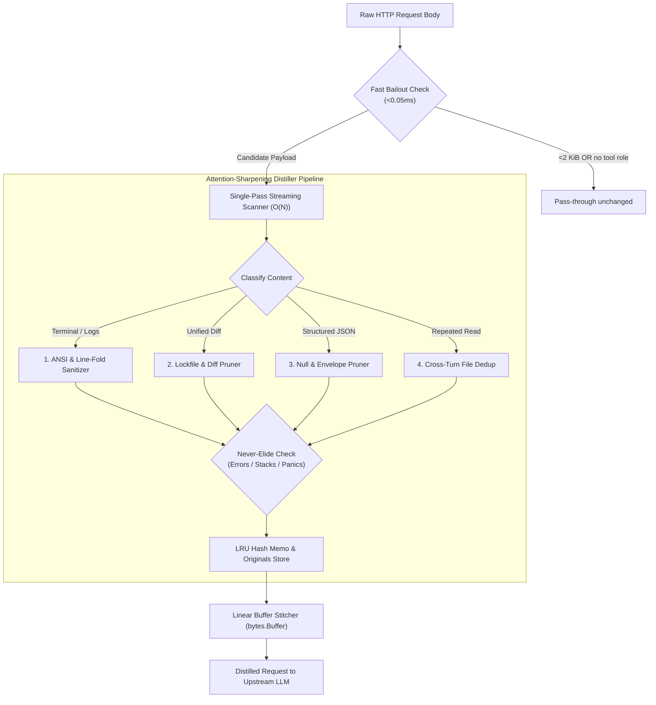

# Design — Squoze v2: Attention-Sharpening Context Distiller

Status: Draft for Review · Created: 2026-09-02 · Spec: [requirements.md](requirements.md)

## 1. Architecture Overview

Squoze v2 redesigns the internal processing model from a multi-scan JSON tree navigator into a **Single-Pass Streaming Byte Slicer and Attention-Sharpening Distiller**.



---

## 2. Root Cause of v1 Slowness and the v2 Solution

### The v1 Flaw ($O(N^2)$ Complexity):
In Squoze v1, `processOpenAIChat` executed:
```go
n := int(gjson.GetBytes(body, "messages.#").Int())
for i := 0; i < n; i++ {
    role := gjson.GetBytes(body, "messages." + itoa(i) + ".role").String()
    c := gjson.GetBytes(body, "messages." + itoa(i) + ".content")
    ...
    body, _ = sjson.SetBytes(body, "messages." + itoa(i) + ".content", out)
}
```
For a 633 KiB payload with 40 messages:
- `gjson.GetBytes` parsed the JSON from byte 0 for every message property ($40 \times 2 = 80$ scans over 633 KiB).
- `sjson.SetBytes` re-allocated and re-sliced the entire 633 KiB array on every replacement.
- Result: **438ms latency** and over 35 MB of garbage collection pressure.

### The v2 Solution ($O(N)$ Streaming Slice Builder):
Squoze v2 implements an allocation-conscious streaming scanner:
1. **Zero-Scan Indexing:** A single sequential byte scanner locates `"role":"tool"` and extracts boundaries `[content_start, content_end]` in one pass ($O(N)$).
2. **Buffer Stitching:** Unmodified segments are sliced directly from the original byte slice (`body[last_end:next_start]`). Only distilled segments are written into an pre-allocated `bytes.Buffer`.
3. **Target Latency:** Under 2.5ms on a 633 KiB payload (>175× speedup).

---

## 3. The 4 Attention-Sharpening Distillation Engines

### 3.1 Module 1: ANSI & Terminal Noise Sanitizer
- **Problem:** Command outputs from compilers, linters, tests, and package managers dump ANSI escape codes (`\x1b[32m`, `\x1b[0m`, `\x1b[2K`), carriage returns (`\r`), and terminal spinner redraws. Each escape sequence splits into 3–6 useless tokens in the LLM tokenizer, polluting the attention matrix.
- **Algorithm:**
  1. Fast byte-scan for `0x1B` (ESC) and `\r`. If absent, skip.
  2. State machine strips ANSI CSI sequences (`\x1b[ ... [a-zA-Z]`).
  3. Carriage returns followed by line feeds are normalized; standalone `\r` (in-place line overwrites from progress bars) collapses to the final line state.
  4. **Line-Folding:** Consecutive identical lines (e.g. `Downloading...` or `polling status...` repeated 50 times) are collapsed into `line + " [... repeated 50 times ...]"`.

### 3.2 Module 2: Diff & Lockfile Distiller (Diff-Squoze)
- **Problem:** In coding agents, `git diff` or `git status` frequently outputs thousands of lines of lockfile changes (`package-lock.json`, `go.sum`, `Cargo.lock`, `pnpm-lock.yaml`, `poetry.lock`) or minified bundle diffs (`*.min.js`, `*.map`). LLMs cannot reason over hash changes in lockfiles; reading them causes severe "Lost in the Middle" errors and token waste.
- **Algorithm:**
  1. Detect unified diff header: `diff --git a/... b/...` or `--- a/... +++ b/...`.
  2. Inspect the file path. If the extension or filename matches `IsGeneratedOrLockfile(path)`:
     - Count added/removed lines.
     - Replace the entire diff section with:
       `[... squoze: %d lines of %s diff elided (ref %s) ...]`
  3. For actual source code files, preserve changes verbatim. Only compact consecutive unchanged context lines exceeding 8 lines down to 3 lines with a compact marker `[... %d unchanged lines ...]`.

### 3.3 Module 3: JSON Structural Pruner (J-Squoze)
- **Problem:** Tool outputs from REST APIs (Kubernetes, AWS, GitHub, SQL queries) return verbose JSON with `null` fields, empty arrays `[]`, empty dictionaries `{}`, and tracing metadata (`request_id`, `_links`, `__typename`, `etag`).
- **Algorithm:**
  1. Fast validation of JSON prefix (`{` or `[`).
  2. Light-weight recursive stream filter:
     - Drop any key where value is `null`.
     - Drop any key where value is empty array `[]` or object `{}` (unless it is the root).
     - Filter known envelope metadata keys (`__typename`, `_links`, `trace_id`, `request_id`, `etag`, `schema_version`).
  3. Re-encode as dense JSON or compacted key-value format.
  4. **Quality Guarantee:** 0% loss of actual non-null business data; 25–50% token reduction; sharper attention for key extraction.

### 3.4 Module 4: Cross-Turn Stale Read Deduplication (Dedup-Squoze)
- **Problem:** An agent loops: Turn 2 reads `auth.go` (400 lines), Turn 4 edits a line, Turn 6 reads `auth.go` again. Turns 2 and 4 now contain obsolete copies of `auth.go` that clutter the context and confuse the model with old code versions.
- **Algorithm:**
  1. Calculate xxHash64 of large content blocks (>500 bytes) associated with file read tools (`view_file`, `cat`, `read_file`).
  2. Track seen hashes across the message sequence.
  3. If block in Turn $T_{early}$ is identical to or shadowed by a later read in Turn $T_{late}$, replace the early block with:
     `[... squoze: earlier view of %s identical to Turn %d (ref %s) ...]`
  4. Only the active working turn retains the full file content.

---

## 4. Never-Elide & Quality Guardrails

```go
func MustKeep(line string) bool {
    u := strings.ToUpper(line)
    for _, pat := range []string{
        "--- FAIL", "FAIL:", "FAILED", "PANIC:", "FATAL", "ERROR", 
        "EXCEPTION", "ASSERTIONERROR", "TRACEBACK", "BUILD FAILED", 
        "EXIT STATUS", "NON-ZERO EXIT", "UNDEFINED:", "SYNTAXERROR",
    } {
        if strings.Contains(u, pat) {
            return true
        }
    }
    return false
}
```
Whenever an error line is detected:
- The error line is preserved 100% verbatim.
- A context window of 3 preceding lines and 5 succeeding lines is rescued alongside the error line.
- The model always sees the complete stack trace and failure reason.

---

## 5. Cache-Safety and Reversibility

### 5.1 Deterministic Hash Memo
To maintain prompt cache hits with upstream providers (Anthropic prompt caching, OpenAI auto-caching):
- Decisions are keyed by `(ModelFamily + "\x00" + ContentHash)`.
- If an identical tool block is seen again in subsequent turns, Squoze returns the exact byte sequence from the LRU memo (`store.Memo`).
- Because the distilled bytes are deterministic and immutable across turns, provider prefix caching achieves 100% hit rate.

### 5.2 Local Originals Store & Tool Reversibility
- Every elision records the original content in `store.Originals` keyed by a 12-character hex hash (`ref <hash>`).
- If an agent actually needs the elided content, it can call a built-in virtual tool or command `squoze retrieve <ref>` to restore the full text into context.

---

## 6. Integration Contract with 2papi

In 2papi's `internal/proxy/proxy.go`:
```go
if activeOptimization.Squoze {
    distilledBody, result := squozeEngine.Apply(body)
    if result.SavedBytes > 0 {
        body = distilledBody
        r.Header.Set("X-Gateway-Squoze", "distilled")
        r.Header.Set("X-Gateway-Saved-Bytes", strconv.Itoa(result.SavedBytes))
        r.Header.Set("X-Gateway-Squoze-Latency-MS", fmt.Sprintf("%.2f", result.DurationMS))
    }
}
```
- Fully compatible with 2papi's exclusive mode rules.
- Echoes diagnostic headers for observability in the 2papi dashboard.
