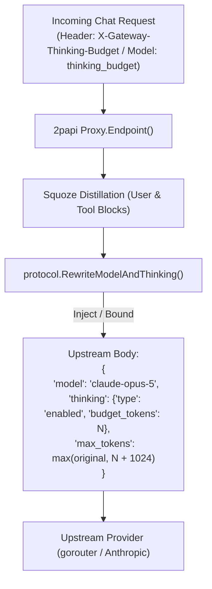

# Design — Thinking Budget & User Tool Squoze

## 1. Thinking Budget Architecture



### Config Extension (`internal/config/config.go`)
```go
type Model struct {
    ...
    ThinkingBudget int `yaml:"thinking_budget,omitempty" json:"thinking_budget,omitempty"`
}
```

### Protocol Transformation (`internal/protocol/protocol.go`)
```go
func RewriteModelAndThinking(b []byte, upstream string, thinkingBudget int) ([]byte, error) {
    // 1. Rewrite model name
    // 2. If thinkingBudget > 0, set thinking.type = "enabled" and thinking.budget_tokens = thinkingBudget
    // 3. Ensure max_tokens >= thinkingBudget + 1024
}
```

---

## 2. User Tool Squoze Scanner (`squoze/internal/engine/user_tool_scanner.go`)

### Block Recognition
Detects three primary agent formats within `role: "user"`:
1. **XML Tags**:
   - `<tool_output name="...">` ... `</tool_output>`
   - `<command_output>` ... `</command_output>`
   - `<file_content path="...">` ... `</file_content>`
2. **Fenced Code Blocks**:
   - ````terminal\n` ... `\n````
   - ````diff\n` ... `\n```` (when diff contains lockfile headers or > 30 lines)
3. **Whole-Message Machine Output**:
   - When user message begins with `diff --git`, `=================== test session starts ===================`, or `Command output:`.

### Preservation Contract
```
[User Instructions (VERBATIM)]
<tool_output>
  [Squoze Compressed Diagnostics / Logs]
</tool_output>
[Follow-up Instructions (VERBATIM)]
```
Only the substring within the machine tags is passed to `e.distillText(f, inner)`. All other text is untouched.
