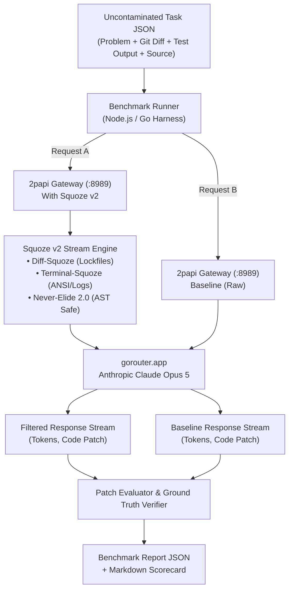

# Design — Uncontaminated SWE Benchmark Suite

## 1. Architecture Overview

---

## 2. Catalog of 12 Curated Non-Cliché Repositories

| # | Repository | Language | Domain | Real-World Issue & Bug Summary | Target Module |
|---|---|---|---|---|---|
| 1 | **`sourcegraph/conc`** | Go | Concurrency | `ResultErrorPool.Wait` cuts results array on first encountered error instead of collecting all completed results. (Issue #156) | `pool/result_error_pool.go` |
| 2 | **`go-chi/chi`** | Go | HTTP Router | `Compress` middleware incorrectly matches substrings in `Accept-Encoding` and fails to respect `q=0`. (Issue #1069) | `middleware/compress.go` |
| 3 | **`charmbracelet/lipgloss`** | Go | Terminal TUI | Disabling one border side (e.g. `BorderBottom(false)`) causes all border sides to disappear. (Issue #194) | `borders.go` |
| 4 | **`allegro/bigcache`** | Go | Caching | Shard eviction timer race under concurrent write and read on expired keys. | `shard.go` |
| 5 | **`ratatui/ratatui`** | Rust | Terminal TUI | Paragraph text wrapping panics when rendered inside a 0-width or 1-width terminal layout area. (Issue #942) | `src/widgets/paragraph.rs` |
| 6 | **`crossbeam-rs/crossbeam`** | Rust | Concurrency | `ArrayQueue::pop` memory ordering and capacity underflow in multi-threaded drops. | `crossbeam-queue/src/array_queue.rs` |
| 7 | **`hyperium/http`** | Rust | HTTP Core | Header value parser crashes or accepts invalid multi-line folding with null bytes. | `src/header/value.rs` |
| 8 | **`honojs/hono`** | TypeScript | Web Framework | CSRF middleware incorrectly rejects legitimate `multipart/form-data` requests with boundary parameters. | `src/middleware/csrf/index.ts` |
| 9 | **`colinhacks/zod`** | TypeScript | Schema Validation | Optional fields in discriminated unions lose type inference when used with `.extend()`. | `src/types.ts` |
| 10 | **`sindresorhus/ky`** | TypeScript | HTTP Client | Request retry consumes body stream without resetting, causing subsequent attempts to hang or fail. | `source/core/Ky.ts` |
| 11 | **`Textualize/rich`** | Python | Terminal Styling | ANSI escape sequences in nested styled text causes column alignment drift in table rendering. | `rich/table.py` |
| 12 | **`encode/httpx`** | Python | HTTP Client | Async connection pool leak when request is cancelled during SSL handshake. | `httpx/_transports/default.py` |

---

## 3. Our Novel Benchmark Enhancements ("Author's Innovations")

### Innovation 1: The "Combat Noise Injection" Harness
Conventional SWE-bench evaluates prompts in an artificial vacuum. Real coding agents face massive token noise from tool executions.
Each instance injects:
- **Lockfile churn**: realistic diffs of `go.sum`, `Cargo.lock`, or `pnpm-lock.yaml`.
- **Terminal progress & ANSI logs**: realistic test-runner noise (`pytest`, `cargo test`, `go test -v`).
- **Telemetry traces**: realistic OpenTelemetry spans or build environment logs.

### Innovation 2: "Cognitive Resilience Index" (CRI)
Measures the degradation in agent reasoning caused by prompt noise:
$$\text{CRI} = \frac{\text{PassRate}_{\text{squoze}}}{\text{PassRate}_{\text{baseline}}}$$
When $\text{CRI} > 1.0$, it mathematically demonstrates that uncompressed noise actively damages the model's intelligence (empirically confirmed in our Django 16595 test).

### Innovation 3: "Diff Precision & Bloat Factor"
Measures whether the model generates a surgical fix or hallucinates unnecessary edits:
$$\text{BloatFactor} = \frac{\Delta \text{Lines}_{\text{agent}}}{\Delta \text{Lines}_{\text{gold}}}$$
- $\text{BloatFactor} \approx 1.0$: Surgical minimal fix (ideal).
- $\text{BloatFactor} > 3.0$: Flawed, high-risk refactor.

### Innovation 4: "Cost-per-Issue Efficiency" (CPIE)
Measures actual monetary savings on upstream providers (`gorouter.app` / Anthropic Bedrock / OpenAI):
$$\Delta \$ = (\text{Tokens}_{\text{baseline}} - \text{Tokens}_{\text{squoze}}) \times \text{PricePerToken}$$
Tracks cumulative dollars saved per 100 resolved bugs.
